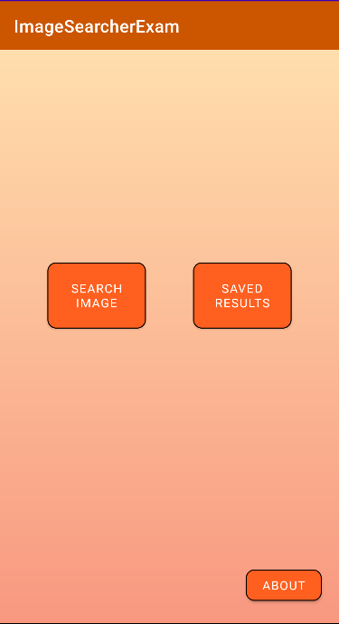
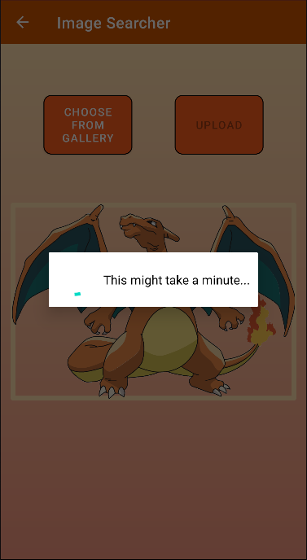
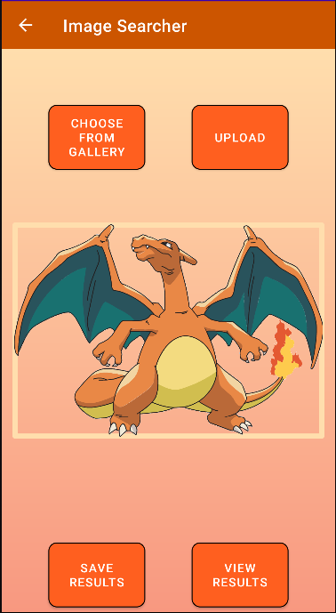
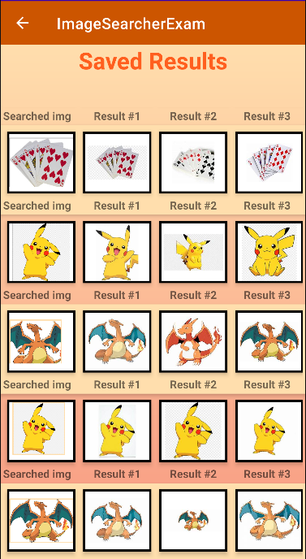
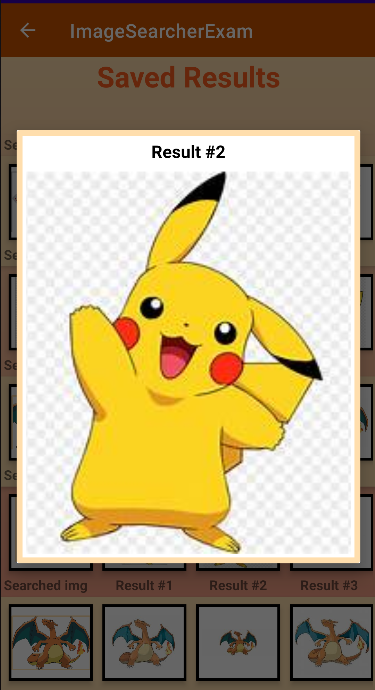

ANDROID PROGRAMMING EXAM - (REVERSE IMAGE SEARCHER APP):
=======================================================

Dependencies and libraries used:
- Fast Android Networking (https://github.com/amitshekhariitbhu/Fast-Android-Networking)
- Jackson Module Kotlin(https://github.com/FasterXML/jackson/)
- Android Room Database for storing search results locally on device. 

The app we have made lets you upload images from the gallery on your
Android device to search for similar images on the internet.

- First you upload images to an external server

  
- Next, the server returns a image URL
  
- The URL is automatically sent to an API that is connected to Bing's image searcher.
  
- The API returns the most similar images to the one you uploaded.
  
- The app then gives you the option to save the search you made and the three most similar images
to the one you uploaded.
  

-On the "Saved Results section", all the saved search results are displayed on screen and the images
  are viewable in fullscreen mode.

The upload feature currently only allows for PNG files. If no similar images are found,
try uploading a different image or give it a few minutes and try the same one again.
Server has been facing minor difficulties.

